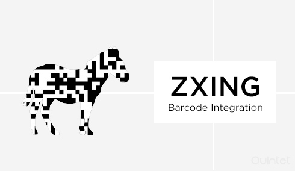

   

 

# Overview

ZXing ou Zebra Crossing como tambem é chamada, é uma biblioteca open source feita em Java, para processamento de imagem em formato barcode. Ela tambem foi portada para outras linguagens como PHP, Javascript, C++, Delphi. Neste repositorio/projeto, mostro de maneira basica como implementar um QRCode,para 9 funcionalidades diferentes. A biblioteca ZXing, tem mais funções e muito mais customizações, portanto você pode acessar o github do ZXing para melhores informações. O intuito desse meu projeto foi apenas como base de treinamento e curiosidade sobre a biblioteca e tambem ajudar a quem possa interessar para iniciar a implementação de algum código utilizando a mesma, por isso tentei fazer da maneira mais simples possivel, a fim de ficar claro o entendimento. O projeto é apenas uma API com endpoints get que irão gerar arquivos PNG com QRcodes,mas como uma base facil para uma possivel customização.

 

<strong>By </strong>Thiago de Andrade

 

# Endpoints

<h1 align="center">
   
</h1>
